# Don't trust me bro: 3.49B tokens, 320,192 evals, 8 seeds, at batch size 1 over 1,062 GPU hours on a single RTX 3090. And an inference harness that fixes gpt-oss.

## Abstract

These 44 figures are the complete chart record behind the report: 320,192 evaluations of gpt-oss-20b, 3.49B tokens, 8 seeds per configuration at batch size 1, over 1,062 GPU hours on a single RTX 3090.

The 3.49B headline is ~3.12B input tokens and ~367M output tokens, of which ~154M is recorded reasoning/thinking and the remaining ~214M is the visible answer — the remainder of output after subtracting the recorded reasoning, since the per-run thinking/visible split is recorded for only 28,661 of the 320,192 runs.

Every phase compares the burrito harness against vanilla vLLM and llama.cpp clients, and every figure set uses the same five reliability metrics: mean accuracy, pass@8 (solved by at least one of eight seeds), pass^8 (solved by all eight), fail^8 (failed by all eight), and error rate.

Phases 1 and 2 cover the full sweep at medium effort, first across all backends and wire APIs, then GPT-OSS on AIME25 and GPQA without tools.

Phases 3 and 4 add reasoning-effort sweeps over BFCL_v4 and GPT-OSS, with the python tool enabled on AIME25.

Phase 5 goes deep on multi-turn work, adding pass curves and turn-survival analysis.

Phase 6 is the exploratory study of how much reasoning-effort differences are real signal.

Read in order, the figures surface the report's seven findings.

The irrelevance paradox: vanilla clients on the default template score 99.9% on BFCL's irrelevance test because any non-tool-call, including a silent failure, counts as correct, while burrito sits at 92.1–92.4% and enabling the FC model pulls every backend to a common 85.4–86.1%.

The jinja fix: removing "commentary" from the valid output channels when no tools are present moves live_relevance from 3.1% to 41.4% and live_simple from 3.1% to 36.7%, and on tool-free AIME25/GPQA it puts llama.cpp at exact parity with burrito (73.8/67.5), with the phase's only nonzero error rate (3.3% of AIME25) vanishing once the template is fixed.

Wire-API differences: on multi-turn work with AST parsing, vLLM's responses API errors on 83.5% of units versus 36.0% on chat, even though it is the more accurate of the two.

Multi-turn base: schema tool definitions (fc=1) hold all-seed pass rates of 13.5–27.5% while AST parsing (fc=0) is near empty, and the cumulative survival curves show per-step failure compounding: fc=1 configurations keep 0.9–7.1% of all runs alive through turn 6, fc=0 is gone by turns 3–4, and the vanilla AST-parsed backends are almost dead at turn 0 itself.

Preserved thinking: a marginal nudge, slightly up with schema tools (56.62% vs 56.12%) and slightly down with AST.

Reasoning effort: low to medium is a genuine strategy change on AIME25 (38.3 to 73.8%), medium to high is mostly volume (10 more points for roughly 3× the tokens), and the token-matched controls (Figs. 6.15–6.16) show that at an equal reasoning budget higher effort simply reasons better (38.3/97.1/100.0% at ~1.4k reasoning tokens for low/medium/high), while ~90k+ reasoning-token runs collapse to ~38–44%.

Python tools: +21.25 points on AIME25 at low effort, and 85.83% at medium effort on about half the thinking of the no-python run.

Taken together, the set demonstrates that the stack around the model is the bottleneck: the same gpt-oss-20b ranges from 0% (vanilla clients with AST parsing and the broken jinja template on multi-turn work) to ~87% (AIME25 at high effort), and the pass@8 / pass^8 / fail^8 triplet in every phase decomposes each task into reliably solved, reliably broken, and per-seed luck, which on tool-free AIME25 is 93.3% solvable by some seed but only 36.7% by all seeds.

The practical conclusion lands on one Pareto point, medium effort with schema tool definitions (76.1–76.7% on pooled BFCL at 377–407 median tokens, versus 74.3–75.9% at 1,362–1,975 tokens on high effort), and on the tool-free benchmarks the fixed template alone puts vanilla llama.cpp at parity with the harness.

Burrito's contribution lives at the harness layer: the template fix, the completions-wire choice, and the tool parsing that turn a structurally trained model into a reliable one.

Terminology: a unit is a single benchmark item — a task, problem, or question; a run (one row of the data) is one model's attempt at one unit under one configuration and one seed, and for a multi-turn unit a trajectory is that attempt across its turns. Output tokens split into thinking/reasoning tokens and the visible answer — output tokens always mean the whole.

## Phase 1 — full sweep, medium effort, non-GPT-OSS, burrito-pt excluded; grouped by backend, fc_model, wire_api

### Fig. 1.1 — mean accuracy by task, across all seeds

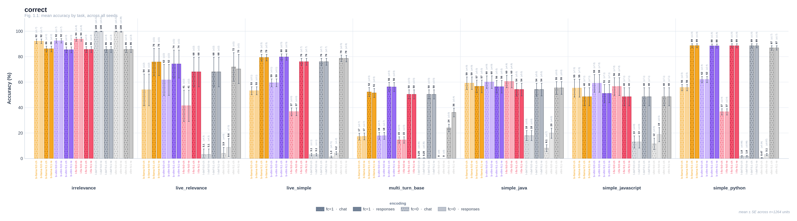

> Vanilla clients on the default chat template (fc0) sit at 99.9% on irrelevance because their non-tool-call responses count as correct, while burrito sits at 92.1–92.4% and the fixed-jinja template at 93.8%. Enabling the FC model (fc1) pulls irrelevance to a common 85.4–86.1% across all backends and closes the jinja gap on live tasks: live_relevance moves from 3.1% (default jinja, fc0) to 41.4% (fixed jinja, fc0) to 68% (fc1), and live_simple from 3.1% to 36.7% to 76%. multi_turn_base shows the FC model's effect most strongly, rising from 0–17.8% with fc0 to 50.4–56.2% with fc1, and vanilla vLLM is the only client whose chat and responses values diverge, most visibly in fc1 multi-turn accuracy (23.9% versus 36.1%).

### Fig. 1.2 — task solve rate on at least one seed

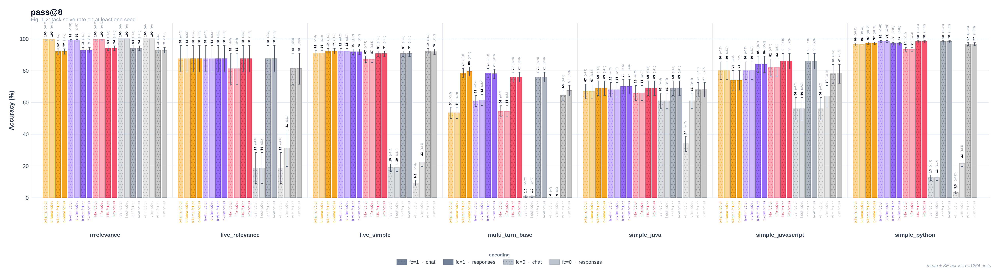

> Solving on at least one of eight seeds, every backend clears 99% of irrelevance tasks (100% for the default-jinja and vLLM fc0 variants, 92.1–94.2% with fc1). The jinja fix shows up in live tasks: with fc0, default jinja solves 18.75% of live_relevance (31.25% on vLLM responses) and 19.0% of live_simple (9.3–22.5% on vLLM), while the fixed template reaches 81.25% and 87.2%, and with fc1 all variants converge on 68–98% across the live and simple tasks. multi_turn_base remains the clearest FC-model test: with fc0, vanilla vLLM solves 0%, llamacpp default jinja 1.0%, and the fixed template 54.5%, while burrito reaches 53.5–61.5%; with fc1, the llamacpp and burrito stacks solve 76–79.5% and vanilla vLLM 64.5–67.5%.

### Fig. 1.3 — task solve rate on every seed

> Demanding that all eight seeds pass, irrelevance holds at 81.7–99.2% for the fc0 variants (vanilla 97.5–99.2%, burrito 81.7%) and drops to 70.8–73.3% with fc1, turning the per-seed paradox into a clean fc0 advantage. The jinja template decides whether all-seed solving is possible: with fc0, default jinja and vanilla vLLM solve 0% of live_relevance, live_simple, and multi_turn_base tasks, and the fixed template only 0.5–6.25%; with fc1, live_relevance reaches 43.8–62.5%, live_simple 51.2–56.6%, and multi_turn_base 1.0–25.5%. On that last task, vanilla vLLM with fc1 solves just 1.0% of tasks on all eight seeds over chat and 6.0% over responses, while the llamacpp and burrito stacks hold 16.5–25.5%.

### Fig. 1.4 — task FAIL rate on every seed

> With fc0, vanilla clients fail every multi-turn task on all eight seeds: vLLM at 100% on both wire APIs, llamacpp default jinja at 99.0%, versus 38.5–46.5% for the burrito stacks and 45.5% for the fixed-jinja template. The template fix cuts the fc0 all-seeds-fail rate on live_relevance from 81.25% to 18.75% (vLLM 81.25% on chat, 68.75% on responses), and fc1 brings multi-turn failures down to 20.5–24.0% across the llamacpp and burrito stacks. Wire APIs diverge on vanilla vLLM: 35.5% of multi-turn tasks fail on all seeds over chat versus 32.5% over responses with fc1, and on simple_python fc0, 96.5% on chat against 78.25% on responses.

### Fig. 1.5 — error rate by task, across all seeds

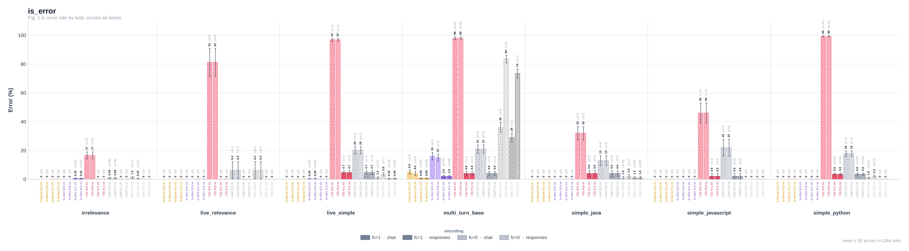

> Burrito records at most 0.42% errored seeds on irrelevance, so its accuracy gap against the vanilla clients there is wrong calls, not errors. The fixed-jinja fc0 column is the outlier: with fc0, default jinja errors on 0.8–22.0% of units, while the fixed template errors on 16.7–99.3%, peaking at 99.25% on simple_python, 98.0% on multi_turn_base, and 96.9% on live_simple. On multi_turn_base, vanilla vLLM's error rate splits by wire API, 36.0% on chat versus 83.5% on responses with fc0 and 29.0% versus 73.5% with fc1, while the burrito stacks stay at 4.0–16.0% (fc0) and 0.5–2.0% (fc1).

## Phase 2 — GPT-OSS (AIME25, GPQA), responses API, medium effort, python/tools off; grouped by backend

### Fig. 2.1 — mean accuracy by task, across all seeds

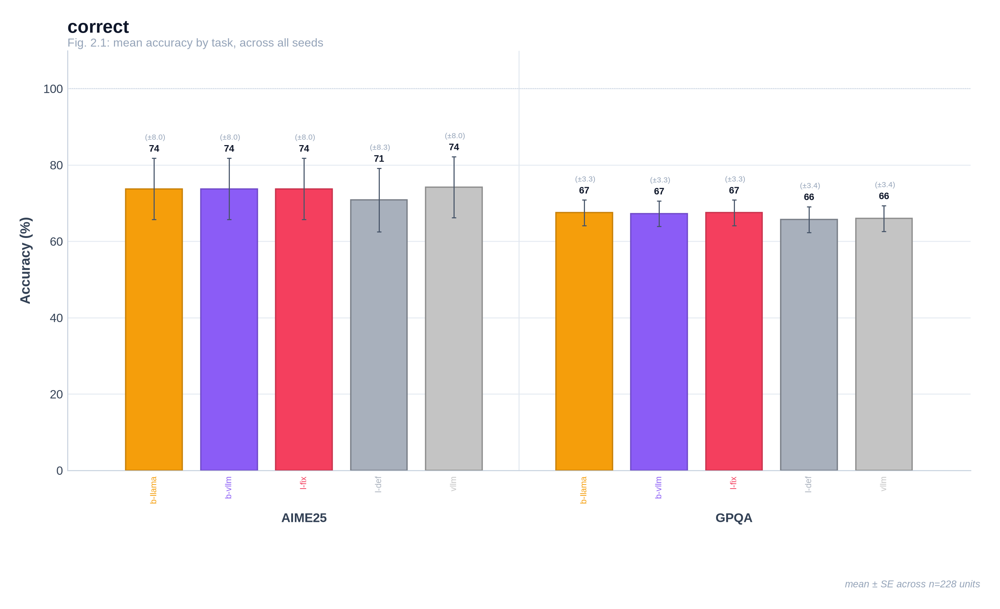

> Mean per-problem accuracy of gpt-oss-20b at medium effort, averaged across the 30 AIME25 and 198 GPQA items with 8 seeds each. The default jinja template costs about three points on AIME25 (70.8 vs 73.8) and 1.8 on GPQA, and swapping in the fixed template brings llama.cpp to exact parity with the burrito-llamacpp backend (73.8 / 67.5) — on these tool-free tasks, burrito's edge over vanilla llama.cpp is the template fix itself. Plain vLLM tops AIME25 at 74.2 but sits 1.5 points below the fixed-template llama.cpp on GPQA.

### Fig. 2.2 — task solve rate on at least one seed

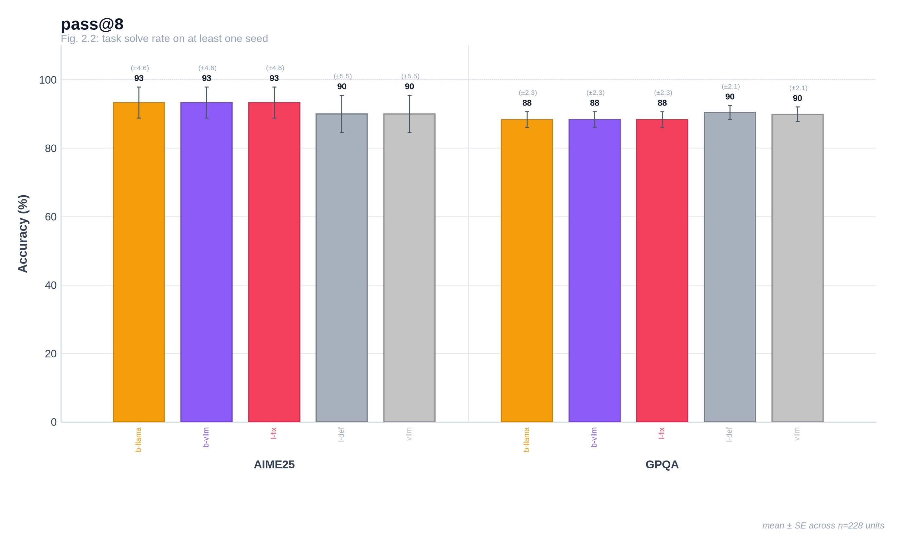

> Share of problems solved on at least one of the 8 seeds: 93.3% of AIME25 for the fixed-template backends (both burrito variants and llamacpp@fixed-jinja) and 88.4% of GPQA, with the default jinja template at 90% on AIME, while on GPQA all five backends land in a tight 88.4–90.4% band. The ~20-point gap between this one-seed ceiling and the per-problem means in Fig. 2.1 is what Figs. 2.3–2.5 decompose into consistent, intermittent, and impossible problems.

### Fig. 2.3 — task solve rate on every seed

> Only 36.7% of AIME25 problems are solved on all 8 seeds by the fixed-template backends — against the 93.3% one-seed ceiling — and the default jinja template sinks the all-seed rate a further 10 points to 26.7%. GPQA is far more stable: all five backends cluster at 41.9–43.9% consistent solves. Medium-effort gpt-oss mostly treats AIME25 as a per-seed coin flip rather than a capability boundary, which no amount of backend swapping changes.

### Fig. 2.4 — task FAIL rate on every seed

> The deterministic-fail side is small: 6.7–10% of AIME25 problems and 9.6–11.6% of GPQA problems fail on all 8 seeds. Combined with the all-pass rates, most of AIME25 (roughly half to two-thirds of items) sits in the middle — neither reliably solvable nor reliably broken — so backend differences on this benchmark are mostly about how often a given seed gets the answer. On GPQA the picture inverts slightly: the fixed-template backends sit at the worse end (11.6%) while default jinja is best (9.6%).

### Fig. 2.5 — error rate by task, across all seeds

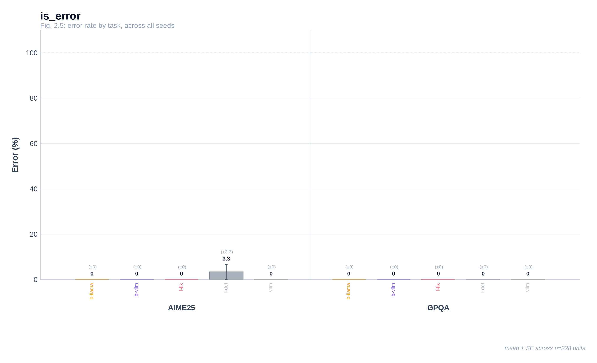

> The only nonzero error rate in the entire phase belongs to llamacpp with the default jinja template: 3.3% of AIME25 problems (1 of 30) produced an erroring response on at least one of the 8 seeds, while every other backend records 0% on both benchmarks. That single bar is the responses-API signature of the broken template — malformed output surfacing as harness errors — and it vanishes entirely once the template is fixed.

## Phase 3 — BFCL_v4, burrito backends, responses API, reasoning-effort sweep

### Fig. 3.1 — mean accuracy by task, across all seeds

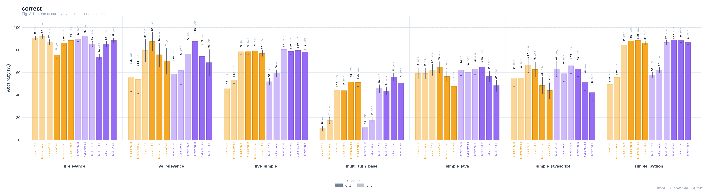

> Mean per-seed accuracy of the burrito stacks on the seven BFCL tasks over the responses API, twelve bars per task by backend (b-llama = llama.cpp, b-vllm = vLLM), tool definition (hatched fc=0 AST parsing, solid fc=1 schema tools) and reasoning effort (·lo/·md/·hi under each bar). Effort pulls accuracy in opposite directions across tasks: multi_turn_base rises from 27.3 (low) through 35.7 to 48.0 (high) and simple_python from 71.0 to 86.0, while simple_java falls from 62.8 to 55.3 and simple_javascript from 60.9 to 54.7, so the pooled BFCL mean only creeps from 62.9 to 63.5 to 69.1. The bigger lever is the tool definition, which the schema-tools side (fc=1, pooled 69.2 versus 61.1 for fc=0) owns on every hard task: +25.1 points on multi_turn (49.5 vs 24.4), +21.7 on simple_python (87.7 vs 66.0), +17.0 on live_simple, +13.0 on live_relevance, while fc=0 keeps the edge on the remaining three, most visibly on irrelevance (89.5 vs 83.0), where the no-tool-call scoring rule penalizes the attempt that schema tools encourage.

### Fig. 3.2 — task solve rate on at least one seed

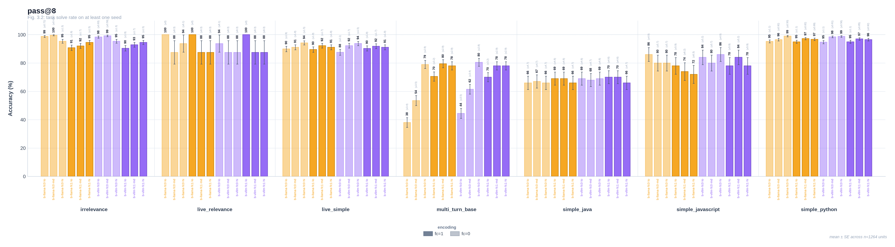

> Share of each task's units solved on at least one of the 8 seeds, in the same twelve-configuration split, with the pooled one-seed ceiling nearly effort-independent across all 1,264 units (83.3 / 84.1 / 85.6 for low/medium/high). irrelevance sits at 90.4–99.6 (99.6 for llama.cpp with AST at medium), simple_python at 94.8–99.0, simple_javascript at 72.0–86.0, and live_simple at 87.6–94.2 across the grid, while multi_turn_base is the one task where effort moves the ceiling, climbing from 55.8 (low) to 68.1 (medium) to 78.9 (high) even though its best single bar (vLLM, AST, high) reaches only 80.5. live_relevance runs the other way, with low effort solving 98.4% of its units, including a perfect 100.0 on llama.cpp, against 87.5–89.1 at medium and high: on this suite, thinking more makes the model miss on more seeds.

### Fig. 3.3 — task solve rate on every seed

> All-eight-seed solve rates for the same grid: fc=1 lifts live_relevance from 20.8 to 57.3, live_simple from 20.1 to 55.0, simple_python from 20.1 to 70.0, and multi_turn_base from 1.9 to 16.9, while the pooled low/medium/high averages barely move (37.5 / 35.5 / 42.1). Even the best configuration clears just 25.5% of multi-turn units (vLLM, fc=1, medium) and 81.7% of irrelevance (llama.cpp, fc=0, medium), and the llama.cpp AST multi-turn bars sit at 0.0–6.0 across all three effort levels. The gap between the 83–99% one-seed ceilings in Fig. 3.2 and all-seed rates that never exceed 81.7%, and stay under 20% on the fc=0 side of the live and multi-turn tasks, means most BFCL work on the responses API is a per-seed coin flip whose odds the tool definition sets far more than reasoning effort does.

### Fig. 3.4 — task FAIL rate on every seed

> Mirror image of Fig. 3.3: the share of units failing on all 8 seeds, with multi_turn_base owning the failure mass at 44.3% on low effort (62.0 llama.cpp, 55.5 vLLM with AST) falling to 31.9 at medium and 21.1 at high, while fc=1 halves the pooled multi-turn rate from 40.5 to 24.3. Every other task stays far lower, with simple_java flat at 31.5–33.3, simple_javascript at 18.5–21.0, simple_python at or under 5.0, the live tasks between 1.6 and 12.5, and irrelevance's 4.1–5.4% band tracking its fc=0 > fc=1 accuracy split (2.2 vs 7.4). The steady decline of the multi-turn failure rate with effort is the reliability side of the reasoning-effort story on the responses API: higher thinking retires deterministic failures on both backends, yet a fifth of multi-turn units never pass even at high effort.

### Fig. 3.5 — error rate by task, across all seeds

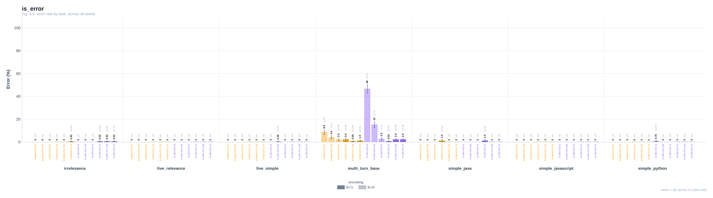

> Share of units with at least one errored run across the 8 seeds, in the same twelve-configuration split, and errors are a low-effort, AST-parsing, multi-turn phenomenon: multi_turn_base records 14.4% of units at low effort, falling to 5.4% at medium and 1.9% at high, with the single worst bar at vLLM/AST/low where 46.5% of its units errored at least once and fc=1 cutting the pooled multi-turn rate from 13.1 to 1.3. All six other tasks sit at or below 0.75% (simple_java 0.5 at low, irrelevance at most 0.42, one 0.39 on live_simple), and the backend split puts most of the error mass in vLLM (11.4 pooled on multi-turn) rather than llama.cpp (3.0). The responses-API error signal in this phase is concentrated in that one vLLM low-effort AST corner, so the harness-level fixes that matter here are tool definition and thinking budget, not the wire protocol itself.

## Phase 4 — GPT-OSS: AIME25 (python on) + GPQA (no tools); burrito, responses API, effort sweep

### Fig. 4.1 — mean accuracy by task, across all seeds

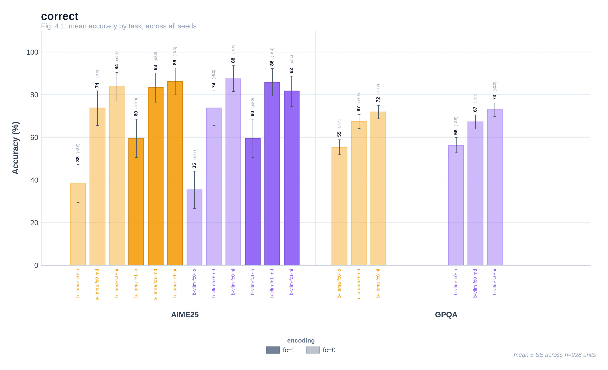

> Per-problem accuracy averaged over 8 seeds for the 30 AIME25 and 198 GPQA problems, across both burrito backends (python enabled on AIME25, no tools on GPQA). Reasoning effort is the dominant dial on AIME25 — burrito@llamacpp without python climbs from 38.33% at low effort to 73.75% at medium and 83.75% at high (±6.74 SE), while GPQA moves only from 55.37% to 71.91% over the same sweep. The python toggle is worth +21.25 points at low effort (59.58% vs 38.33% on llama.cpp) but only −5.83 to +2.50 at high effort, and the llama.cpp and vllm backends stay within a few points of each other in every cell.

### Fig. 4.2 — task solve rate on at least one seed

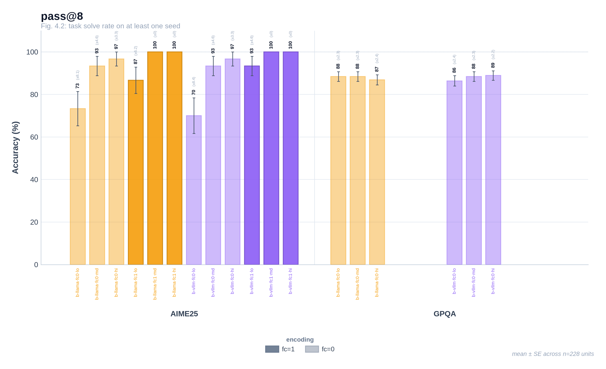

> Share of problems solved by at least one of the 8 seeds (pass@8). AIME25 climbs from 70.00–73.33% at low effort to 93.33–100% at medium/high — all 30 problems cracked by at least one seed under python at medium and high effort on both backends — while GPQA holds a narrow 86.36–88.89% band that effort barely moves. The near-identical GPQA bars are the first sign that extra reasoning buys little new coverage on the knowledge-heavy task.

### Fig. 4.3 — task solve rate on every seed

> Share of problems solved by all 8 seeds (pass^8), the strictest reliability bar in the sweep. AIME25 runs from 10.00–13.33% at low effort to 36.67–66.67% at high, with the vllm-no-python high-effort bar (66.67%) the tallest in the figure, and GPQA from 24.75–26.77% to 52.02–56.06%. Read against Fig. 4.2, the pass@8 minus pass^8 gap — 88.89% vs 56.06% on vllm GPQA at high effort — quantifies how much of the coverage rests on one lucky seed rather than stable competence.

### Fig. 4.4 — task FAIL rate on every seed

> Share of problems failed by all 8 seeds (fail^8). On AIME25 the floor essentially disappears with reasoning — 26.67–30.00% at low effort, 6.67% at medium, 0–3.33% at high, and zero fully-unsolved problems under python at medium/high on both backends — while GPQA keeps an irreducible 11.11–13.64% of problems that no effort level cracks. That GPQA plateau marks the ceiling on what additional reasoning can buy on the knowledge-heavy benchmark.

### Fig. 4.5 — error rate by task, across all seeds

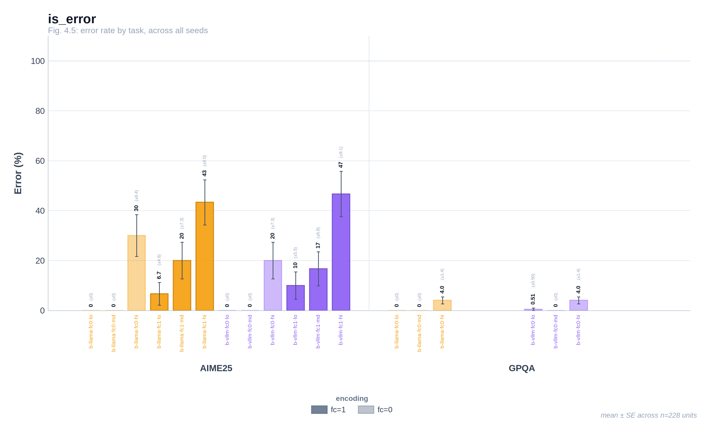

> Share of problems where at least one of the 8 seeds hit an error. Errors concentrate in AIME25 at high reasoning effort — 20.00–46.67% of problems at high effort (43.33% llama.cpp / 46.67% vllm with python, 30.00% / 20.00% without) — with 6.67–20.00% at low/medium in the python configurations, while GPQA never exceeds 4.04%. It is the visible reliability cost behind the high-effort python accuracy bars of Fig. 4.1.

## Phase 5 — multi_turn_base with preserved thinking; burrito, responses API, effort sweep

### Fig. 5.1 — mean accuracy by task, across all seeds

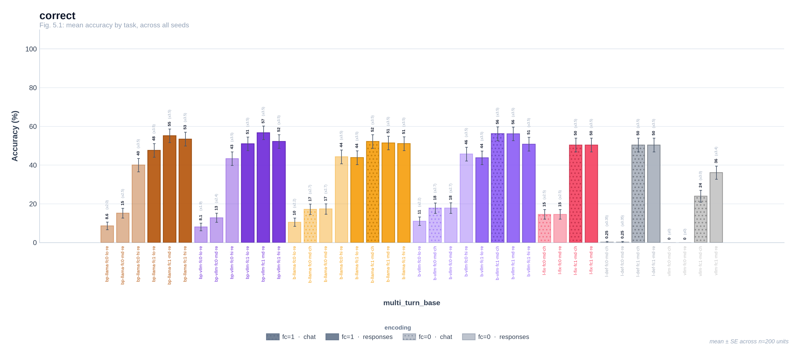

> Per-task accuracy (mean over 8 seeds, n=200 tasks) for every multi_turn_base configuration. Tool-definition format dominates the chart: with schema tools (fc=1) every backend sustains multi-turn — burrito family 43.75–56.62%, vllm 36.12% on the responses wire (23.94% on chat), llama.cpp jinja 50.38% — while AST parsing (fc=0) collapses the vanilla backends (vllm 0.00%, default-jinja 0.25%, fixed-jinja 14.56%) and burrito to 8.06–45.69%. Inside the burrito family the preserved-thinking (pt) variant nudges fc=1 slightly up (56.62% vs 56.12% on vllm, 55.12% vs 51.44% on llama.cpp at medium effort) but fc=0 slightly down (12.81% vs 17.81% on vllm, 15.19% vs 17.31% on llama.cpp), and raising effort mostly rescues the broken fc=0 side (8.06–11.00% at low → 40.00–45.69% at high) while the fc=1 bars stay essentially flat.

### Fig. 5.2 — task solve rate on at least one seed

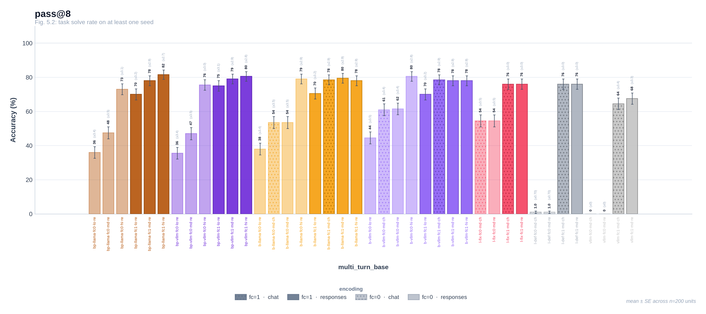

> Share of the 200 tasks solved by at least one of the 8 seeds. Schema tools cover 70.00–81.50% of tasks — the high-effort burrito-pt@llamacpp bar (81.50%) is the tallest in the figure — while AST parsing stays at 35.50–61.50% at low/medium effort and only reaches 73.00–80.50% at high; the vanilla fc=0 backends sit at 0.00% (vllm), 1.00% (default-jinja) and 54.50% (fixed-jinja). Tool mode sets the ceiling on how often a seed can crack a task, and effort only closes the gap between the two modes — from ~25–40 points at low effort down to ~0–8 points at high.

### Fig. 5.3 — task solve rate on every seed

> Share of tasks solved by all 8 seeds — the strictest reliability bar in the sweep. With schema tools, 13.50–27.50% of tasks are solved on every seed, peaking at medium effort (27.50% on burrito-pt@vllm, 25.50% on burrito@vllm) and slipping to 13.50–18.00% at high; with AST parsing the figure is essentially empty, 0.00–0.50% at low/medium effort and only 4.50–8.00% at high. Cross-run reliability on multi-turn work is decided by the tool definition, and medium effort is its sweet spot.

### Fig. 5.4 — task FAIL rate on every seed

> Share of tasks that all 8 seeds fail — work no seed can reach. The AST-parsed vanilla backends are total losses (100.00% on vllm, 99.00% on llama.cpp default-jinja), and low-effort burrito fc=0 leaves 55.50–64.50% of tasks unsolvable by any seed, improving to 19.50–27.00% at high effort. With schema tools the floor settles into an irreducible 18.50–30.00% band that extra reasoning effort barely dents — 25.00–30.00% at low, 20.50–24.00% at medium, 18.50–22.00% at high.

### Fig. 5.5 — error rate by task, across all seeds

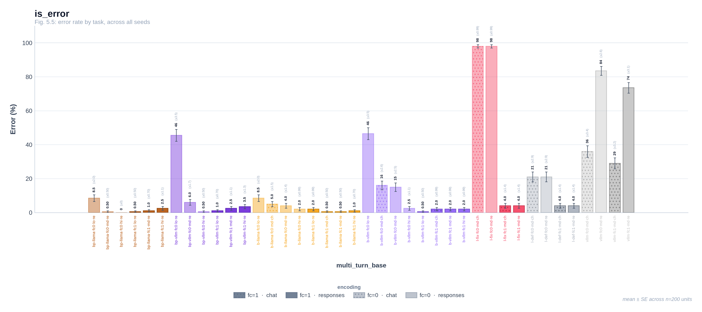

> Share of tasks where at least one of the 8 seeds hit an error. Errors, not wrong answers, are what kill the AST-parsed side: llama.cpp with the fixed Jinja template errors on 98.00% of tasks, vllm on 83.50% (responses wire) and 36.00% (chat), and low-effort burrito fc=0 on 45.50–46.50%. The wire API itself shows up in the vllm pair — 83.50% vs 36.00% with fc=0, and 73.50% vs 29.00% with fc=1 — while the burrito schema-tool configurations stay clean at 0.50–3.50%.

### Fig. 5.6 — pass curves by multi-turn step

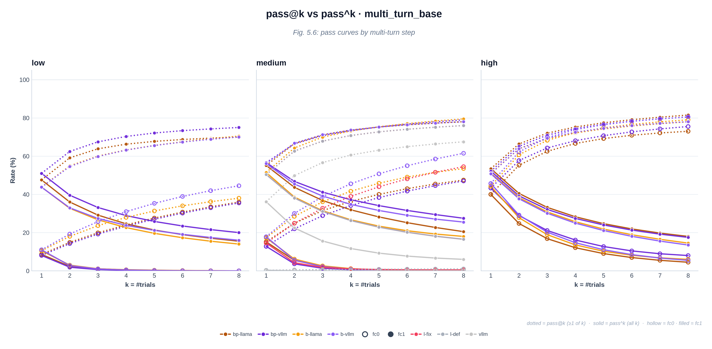

> pass@k (dotted, ≥1 of k seeds) and pass^k (solid, all k) over 8 seeds for the responses-wire configurations, faceted by effort. The solid curves separate the two tool modes cleanly: every fc=1 configuration holds 14–28% all-seed success at k=8 (28% on burrito-pt@vllm at medium effort, 14–18% on the burrito llama.cpp pair at high), while fc=0 curves run out at 0–8% (0.00 at low/medium effort and on vllm / default-jinja at all efforts). The dotted coverage curves stay in a similar 35–81% band for both modes, so the pass^k gap — not coverage — is where schema tools earn their keep.

### Fig. 5.7 — P(pass turn t | reached t) · only turns with ≥10 trajectories · step rate, not path product

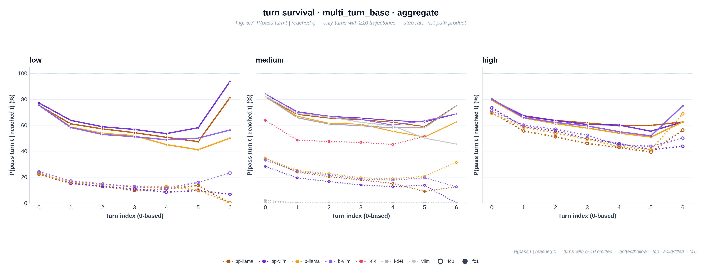

> Conditional step survival — of the runs that reached turn t, the fraction that cleared it — for turns with ≥10 trajectories (turn 6 has only ~13–16, so those points are noisy). Schema tools keep the active cohort healthy through turn 6, with per-step pass rates of 50–85% (83.9% → 68.8% on burrito-pt@vllm at medium effort, 80.2% → 75.0% on burrito@vllm at high), while AST parsing starts much weaker — 22–24% at turn 0 under low effort, 28–34% under medium — and bleeds further every turn. The vanilla fc=0 backends die almost at once: vllm clears turn 0 at just 0.6%, default-jinja at 2.0%, and on fixed-Jinja llama.cpp only 639 of 1,600 trajectories even reach turn 0 — a concrete echo of turn 0 being the wall of multi-turn work.

### Fig. 5.8 — cum. survival = ∏ P(pass t | reached t) · only turns with ≥10 trajectories · end-to-end path estimate

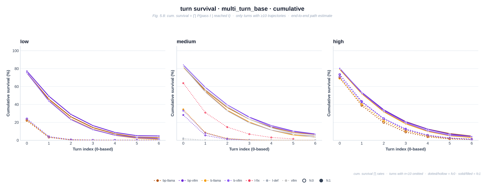

> End-to-end path survival: the product of the per-turn conditional rates, i.e. the estimated share of all runs still alive after turn t under the usual conditional-independence assumption. The two tool modes diverge by an order of magnitude — schema-tool configurations keep 0.9–7.1% of all runs alive through turn 6 (84.2% → 6.7% on burrito@vllm at medium effort, 82.4% → 3.2% on vllm) while AST-parsed configurations fall to ~0 by turns 3–4 (34.4% → 0.0–0.1% on burrito@llamacpp at medium) and the vanilla fc=0 backends are gone by turn 1. Multi-turn reliability is a product of per-step failures, so the modest per-turn gap of Fig. 5.7 compounds into a wall that no effort level fully closes.

## Phase 6 — exploratory reasoning-effort impact

### Fig. 6.1 — rows = tests · cols = reasoning effort · shared log2 x-axis

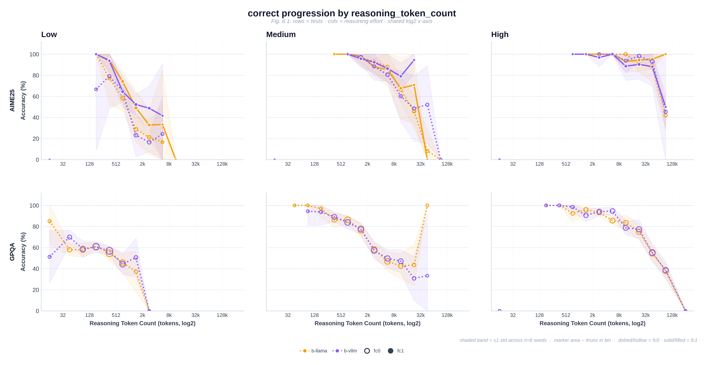

> Accuracy by reasoning-token count on AIME25 and GPQA, one column per effort level on a shared log2 axis. Each effort has its own sweet spot: AIME25 low peaks at 100% in the 128–256 bin and then collapses to 0% by 8k–16k, medium holds ~100% from 256 through 1k and is still ~88–93% at 2k–4k, and high stays above ~88% all the way to 32k–64k. GPQA repeats the shape — low falls from ~50–85% in the ≤64-token bins to 0% by 2k–4k — which is the evidence, for finding 6, that forcing more reasoning tokens than an effort level supports degrades rather than improves accuracy.

### Fig. 6.2 — rows = tests · cols = reasoning effort · shared log2 x-axis

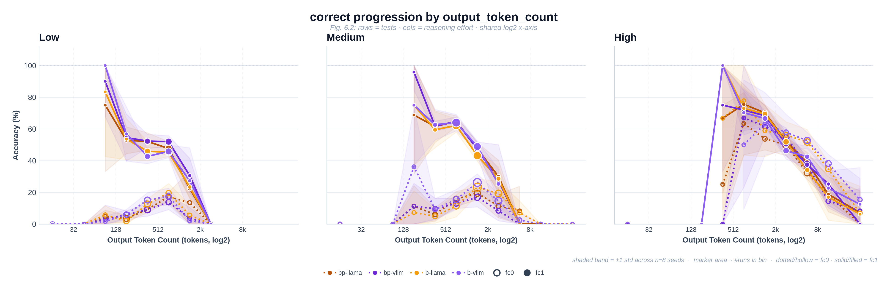

> Accuracy by output-token count on multi_turn_base, the agentic tool-calling test. The peak zone shifts with effort — low peaks at 64–128 tokens (up to 100%), medium at 128–256 (up to 95.8%), high at 256–512 — and every effort degrades as responses get longer, hitting 0% by the 2k–4k bin on low and 0–15% in the largest bins on medium and high. Long chains of tokens do not keep a multi-turn conversation on track, so multi-turn accuracy lives in the peak zone (findings 4 and 6), not at maximum length.

### Fig. 6.3 — rows = tests · cols = reasoning effort · shared log2 x-axis

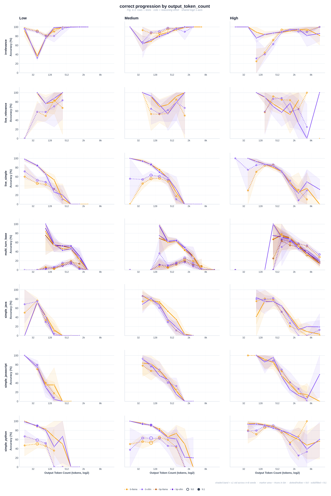

> The same peak-then-degrade shape across all seven BFCL tests, faceted by effort: low effort peaks by 32–256 tokens and is gone by 2k–4k on most tests, while high effort peaks much later, with simple_python at 100% at 4k–8k and live_relevance still at 100% at ≥8k. The one exception is the irrelevance test, which stays at or near 100% across the whole range at every effort — consistent with the irrelevance-paradox finding 1 — so the degradation is specific to the tests that require sustained reasoning (finding 6).

### Fig. 6.4 — BFCL_v4, pooled fc_mode {0,1}

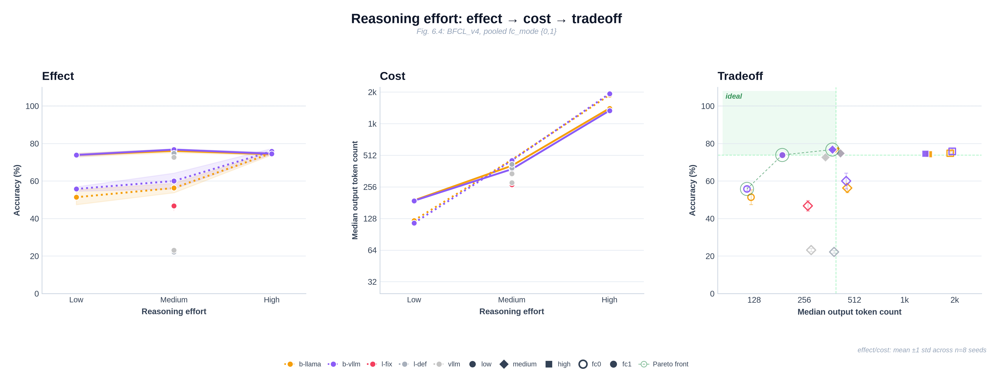

> BFCL_v4 pooled on the responses wire API, in effect / cost / tradeoff panels. fc_model=1 already sits at the top of the effect curve at low effort (73.8–73.9% at ~189–190 median tokens), peaks at medium (76.1–76.7% at 377–407 tokens), and high effort only reaches 74.3–75.9% while spending 1,362–1,975 tokens, so medium with schema tools is the Pareto sweet spot. The fc gap is largest at low effort (73.8–73.9% vs 51.4–55.8% for fc0), and on vanilla backends at medium switching fc0→fc1 lifts 22–47% to ~73–75% — the finding-6 argument that schema tools are a better investment than more reasoning effort.

### Fig. 6.5 — BFCL_v4, fc=0

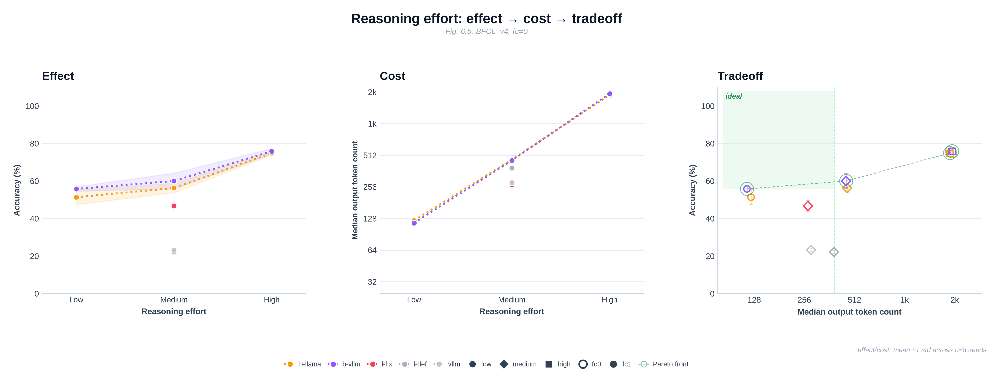

> The same effect–cost–tradeoff structure restricted to fc_model=0 (AST parsing): the effect is cleanly monotone here, with burrito@llamacpp rising 51.4% → 56.3% → 74.9% and burrito@vllm 55.8% → 60.0% → 75.9% from low to high, but median output tokens climb ~16–17× from ~116–123 at low to ~1,917–1,975 at high. Vanilla backends (present only at medium) top out at 22–47%, and the ~75–76% that AST parsing finally reaches at high effort is what fc_model=1 already delivers at medium (76.1–76.7%) for roughly a quarter of the cost — finding 6's conclusion that the effect of effort is real but far from a free lunch.

### Fig. 6.6 — BFCL_v4, fc=1

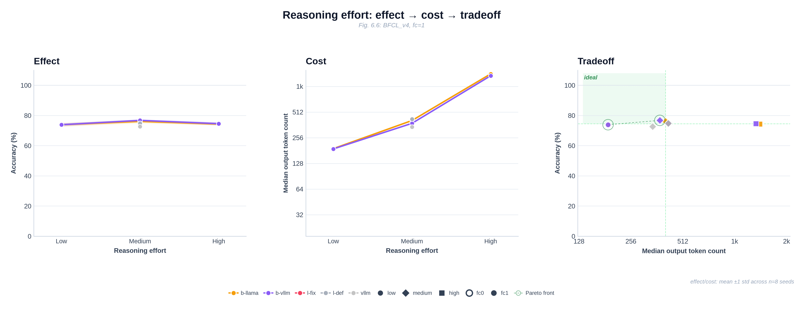

> Effect, cost, and tradeoff for the BFCL_v4 non-GPT-OSS tests on the responses API with fc_model=1 only, across the five non-burrito-pt backends (n=8 seeds). Accuracy is flat: burrito@llamacpp scores 73.8 / 76.1 / 74.3% at low / medium / high effort while its median output tokens climb 190 → 406 → 1,431, so on tool-calling tasks extra thinking buys nothing and costs about 7.5×. Medium effort with schema tools (76.1%) sits on the Pareto front — the only place on this chart worth paying for.

### Fig. 6.7 — BFCL_v4, multi_turn_base, fc_mode {0,1}

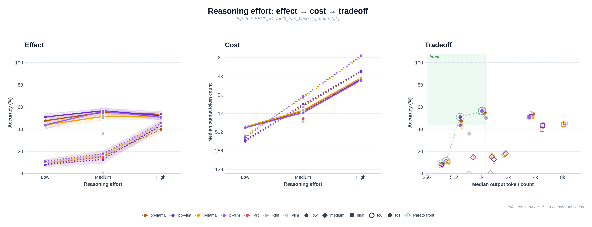

> multi_turn_base on the responses API, both fc modes, all seven backends. On this agentic test the tool-definition gap dwarfs the effort gap: burrito@llamacpp jumps 10.5 → 43.8% going fc_model=0 → 1 at low effort, while inside fc_model=1 the line is flat (51.4% medium vs 51.1% high) with high spending 3.3× the tokens (1,145 → 3,815). The best point on the whole chart is burrito-pt@vllm at medium effort (56.6%): multi-turn accuracy is set by how tool calls are parsed, not by how hard the model reasons.

### Fig. 6.8 — AIME25 and GPQA, pooled

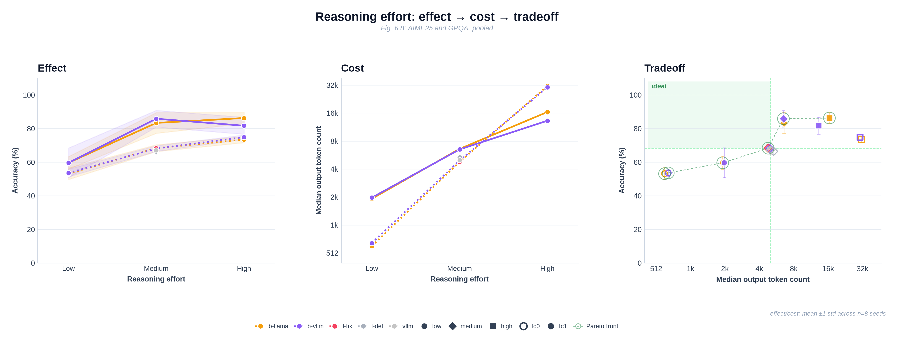

> AIME25 and GPQA pooled on the responses API (GPQA ran fc_model=0 only, so the fc1 lines are AIME25). The low→medium step carries the story: burrito@llamacpp gains 15.2 points on fc_model=0 (53.1 → 68.3%) and 23.7 on fc_model=1 (59.6 → 83.3%), while medium→high adds just 5.2 and 2.9 more as median output tokens go 606 → 31,924. Schema tools at medium (83.3% at 6,738 tokens, AIME25-only) beat schema-free medium (the AIME25+GPQA pool) by 15 points — a better lever than cranking the effort.
> The figure compares per-seed pass^8 at matched reasoning length (y) against pooled accuracy across 8 seeds (x), and the fc_model=1 lines are AIME25-only.

### Fig. 6.9 — AIME25

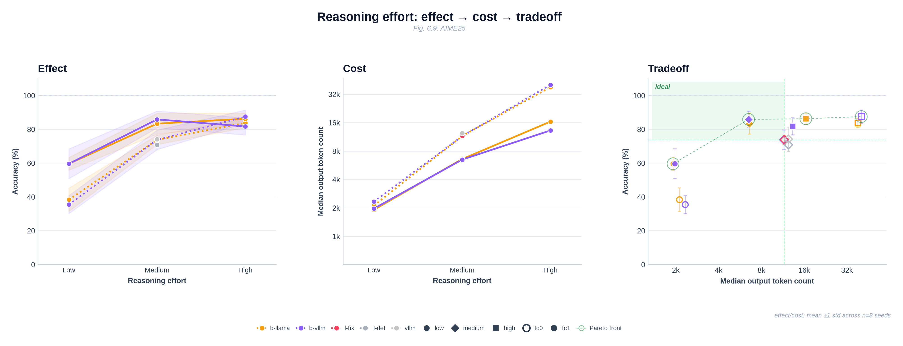

> AIME25, both fc modes, responses API. The low→medium step is a strategy change worth 35.5 points on fc_model=0 (38.3 → 73.8%) for 5.4× the tokens (2,169 → 11,816); medium→high adds only 10 more points for another 3.3× (to 38,971). Schema tools collapse the curve — fc_model=1 medium reaches 83.3% at 6,738 tokens, within 0.5 points of fc_model=0 high at a fifth of the cost.

### Fig. 6.10 — GPQA

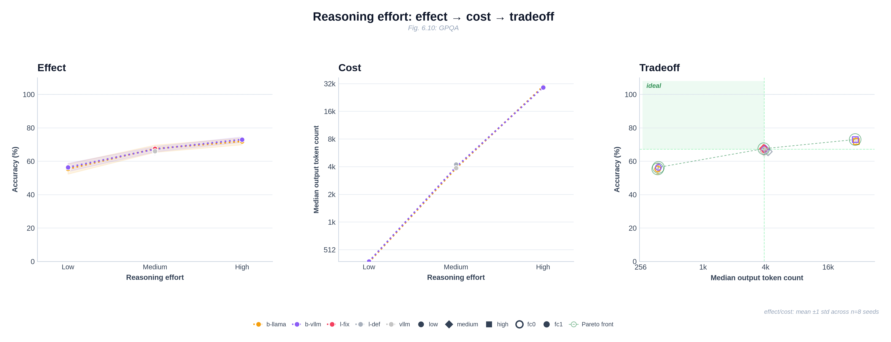

> GPQA ran without schema tools (fc_model=0 only), across the five schema-free backends on the responses API. Same shape as AIME25 but steeper on cost: burrito@llamacpp rises 55.4 → 67.5 → 71.9% as median output tokens climb 374 → 3,927 → 30,511 — a 12.1-point jump for 10.5× the tokens, then 4.4 points for another 7.8×. Medium effort is where GPQA stops buying accuracy.

### Fig. 6.11 — per test grid, both fc modes

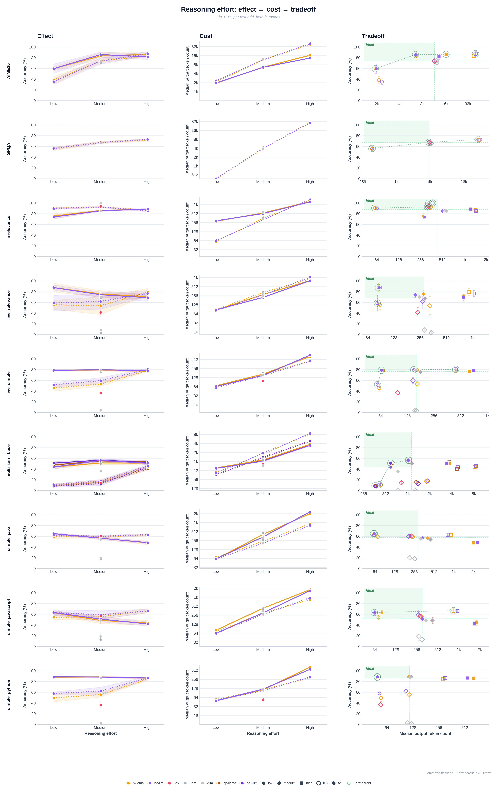

> All nine tests on the responses API, one row per test, both fc modes — the full "not all reasoning is created equal" picture. AIME25 and GPQA climb steeply with effort (burrito@llamacpp fc0: 38.3 → 83.8% on AIME25), multi-turn responds mainly to the fc mode, and the simple BFCL rows are flat or inverted — on simple_java and simple_javascript fc_model=1 accuracy falls from medium to high (56.6 → 47.8 and 48.5 → 44.0). The right effort level is a property of the task, not of the model.

### Fig. 6.12 — Median tokens by reasoning effort

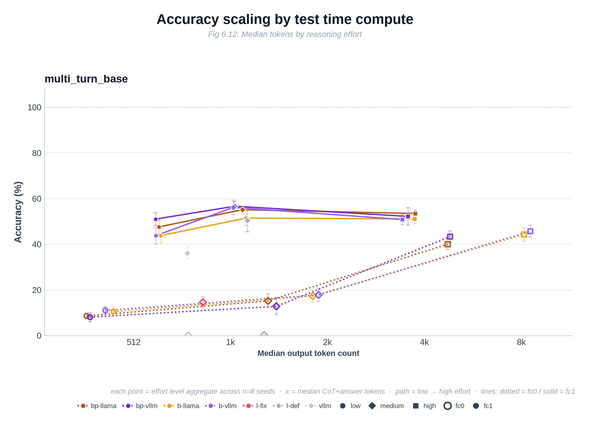

> On multi-turn base — the hardest suite — effort is a long, expensive path for burrito@vllm with AST parsing (fc0): 11.00% accuracy at 418 median output tokens at low effort, 17.81% at 1,921 at medium, 45.69% at 8,733 at high; the same backend with schema tools (fc1) starts at 43.75% and stays above 50% at medium and high on just 1,045–3,494 tokens, while vanilla vLLM and default-jinja llama.cpp points sit at 0.00–0.25% at medium effort, the jinja breakage visible inside the panel. The figure lands the multi-turn finding inside the effort story: on agentic work, effort buys a real climb in output length and accuracy, but it never closes the gap that a correct tool definition and template open.

### Fig. 6.13 — Median reasoning tokens by reasoning effort. fc1 → python tool enabled

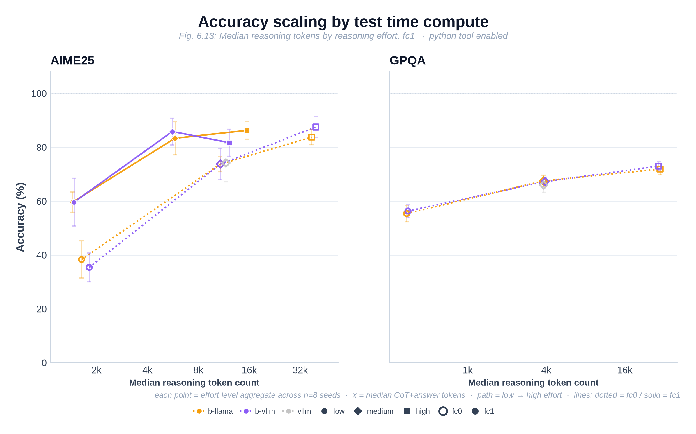

> Only runs that preserve the thinking trace can be plotted here at all: burrito charts the full low → medium → high path on AIME25 and GPQA, vanilla vLLM a single medium-effort point, and the vanilla llama.cpp (jinja) runs record zero reasoning tokens and never appear. For the runs that do think, effort moves the median reasoning budget by up to two orders of magnitude — 357 → 29,736 tokens on GPQA, 1,855 → 40,502 on AIME25 for burrito@vllm without python — with accuracy following from 56.31% to 72.98% and 35.42% to 87.50%, the steepest step between low and medium. With the python tool enabled (fc1), AIME25 reaches 85.83% at medium effort on just 5,745 reasoning tokens — about half the thinking of the no-python medium run — and the path peaks at medium, falling to 81.67% at high, the "python helps most below high effort" pattern.

### Fig. 6.14 — Median output tokens by reasoning effort

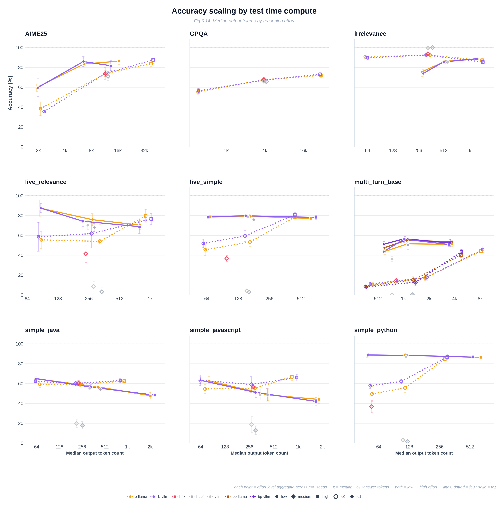

> The nine-suite grid shows where the cost of effort actually lives: on the reasoning benchmarks, burrito@vllm's path runs 2,385 → 41,224 median output tokens on AIME25 (35.42 → 87.50% accuracy) and 380 → 29,777 on GPQA (56.31 → 72.98%), while the single-turn BFCL suites spend at most ~2.4k tokens even at high effort and only multi-turn base approaches ~8.7k. The tool-calling rows also carry the jinja diagnostic, with medium-effort points for vanilla vLLM and default-template llama.cpp collapsing to 0–18% on those suites (multi-turn base 0.00%, simple Python 1.8%). Effort is a real but bounded lever: concentrated where there is genuine reasoning to do, and dwarfed by template and tool-mode effects elsewhere.

### Fig. 6.15 — at matched reasoning length, higher effort still yields higher accuracy · pooled runs

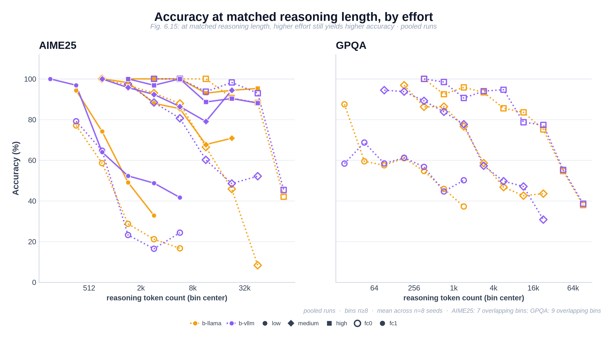

> Bin the AIME25 and GPQA runs (burrito backends, both tool modes, 8 seeds) by reasoning-token budget, and higher effort stays more accurate within essentially every shared bin: at ~1.4k reasoning tokens AIME25 sits at 38.3/97.1/100.0% for low/medium/high, and GPQA at ~724 tokens at 45.3/85.1/95.4% (pooled runs, bins n≥8, 7 and 9 overlapping bins per test). That is the clean falsification of "effort is just buying more tokens" — the token budget explains part of the accuracy gap, and effort explains the rest. The shared right-tail collapse, with high-effort runs at ~90k+ reasoning tokens dropping to ~38–44%, is the overthinking warning the rest of the report leans on.

### Fig. 6.16 — at matched reasoning length, higher effort still yields higher accuracy · within question

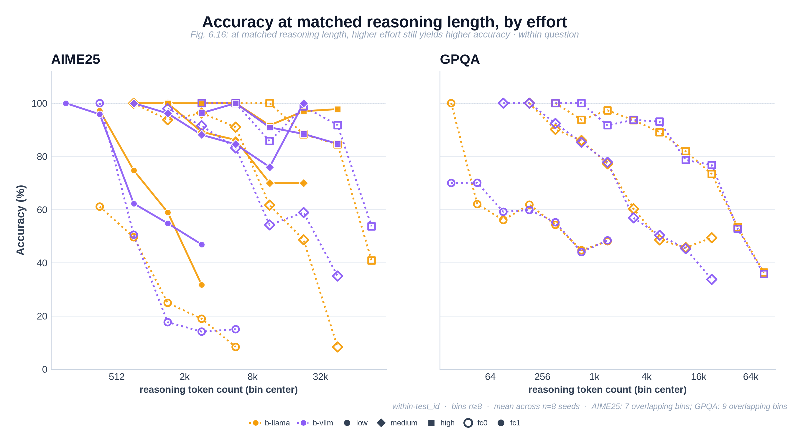

> Averaging each question first, so every AIME25 and GPQA question contributes equally within a token bin, leaves the ordering intact: at ~1.4k reasoning tokens AIME25 runs sit at 39.1/97.0/100.0% for low/medium/high, and GPQA at ~724 tokens at 44.4/85.6/96.9%. The effect is not an artifact of which problems happened to land in a bin. Given the same thinking budget, higher effort simply reasons better, question by question.
